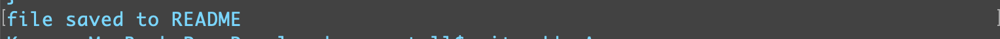

# Node ReadMe Generator

## Description:

This app allows the user to input answers to prompted questions and then a ReadMe.md will be generated.  An [array of the answers](#answers-array) will be generated with a console.log and a [confirmation of the file being saved](#confirmation-of-saved-file) will also appear in the terminal.

## Installation:

To use this app you must install the dependencies by running `npm install` then the user may run the app in the terminal using the `node index.js` command.

## Screenshots

### Answers Array

### Confirmation of Saved File

